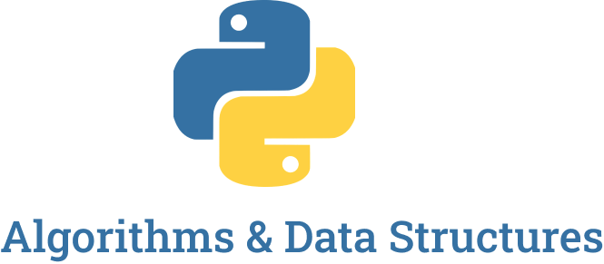

  

## Big O Notation 
> Big O describes how the time is taken, or memory is used, by a program scales with the amount of data it has to work on 

> Big O helps us to measure the scalability of our code

> Big O is a way to indicate complexities (Space Complexity & Time Complexity)

- [Exercises](https://github.com/LauraBeatris/algorithms-and-data-structures/tree/main/big_o_notation/exercises)
- [Cheat Sheet](https://github.com/LauraBeatris/algorithms-and-data-structures/tree/main/big_o_notation/big_o_cheat_sheet.pdf)

### Time Complexity
- [Linear Time - O(n)](https://github.com/LauraBeatris/algorithms-and-data-structures/tree/main/big_o_notation/time_complexity/linear_time.py)
- [Constant Time - O(1)](https://github.com/LauraBeatris/algorithms-and-data-structures/tree/main/big_o_notation/time_complexity/constant_time.py)
- [Quadratic Time - O(n^2)](https://github.com/LauraBeatris/algorithms-and-data-structures/tree/main/big_o_notation/time_complexity/quadratic_time.py)

### Space Complexity
- [Linear Space - O(n)](https://github.com/LauraBeatris/algorithms-and-data-structures/tree/main/big_o_notation/space_complexity/linear_space.py)
- [Constant Space - O(1)](https://github.com/LauraBeatris/algorithms-and-data-structures/tree/main/big_o_notation/space_complexity/constant_space.py)

### Rules
- [Worst Case](https://github.com/LauraBeatris/algorithms-and-data-structures/tree/main/big_o_notation/rules/worst_case.py)
- [Remove Constants](https://github.com/LauraBeatris/algorithms-and-data-structures/tree/main/big_o_notation/rules/remove_constants.py)
- [Different Terms for Inputs](https://github.com/LauraBeatris/algorithms-and-data-structures/tree/main/big_o_notation/rules/different_terms_for_inputs.py)
- [Drop Non Dominants](https://github.com/LauraBeatris/algorithms-and-data-structures/tree/main/big_o_notation/rules/drop_non_dominants.py)